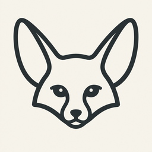
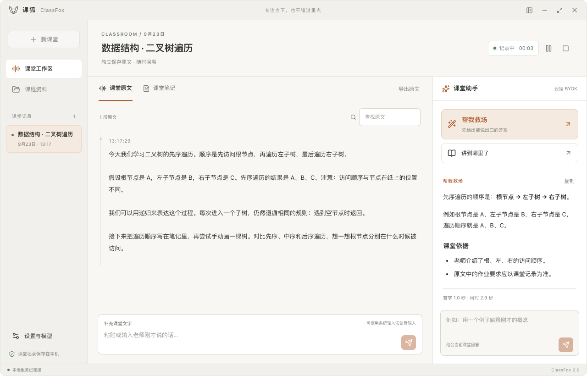
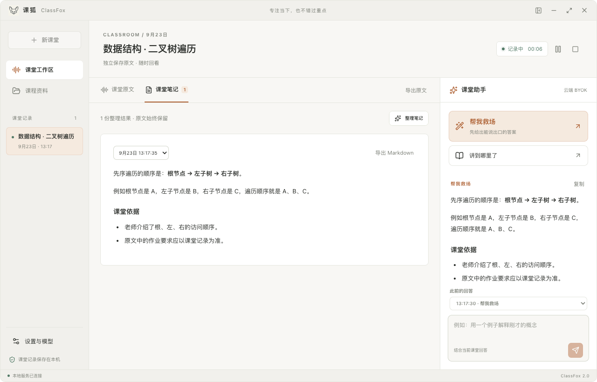
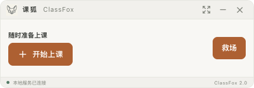

<div align="center">
  <a href="https://class.nexa-lang.com/">
    
  </a>
  <h1>ClassFox · 课狐</h1>
  <p><strong>把注意力，留在课堂。</strong></p>
  <p>课堂原文 · 即时问答 · 课后笔记<br />一个本地优先、免费开源的桌面课堂助手。</p>
  <p>
    <a href="https://github.com/ouyangyipeng/ClassAssistant/releases/latest"></a>
    <a href="LICENSE"></a>
    
  </p>
  <p><a href="https://class.nexa-lang.com/"><strong>访问官网</strong></a> · <a href="https://github.com/ouyangyipeng/ClassAssistant/releases/latest"><strong>下载应用</strong></a> · <a href="https://class.nexa-lang.com/guide/">使用文档</a> · <a href="CHANGELOG.md">更新记录</a> · <a href="https://github.com/ouyangyipeng/ClassAssistant/issues">反馈问题</a></p>
  
  <p><sub>听见一个瞬间，留下一段思路。Meet ClassFox 2.0.</sub></p>
</div>

## 一堂课，一个工作区

不用在录音、聊天和笔记之间反复切换。ClassFox 将原文留在左侧，把课堂助手放在手边。跟上老师的思路，需要时再问一句。

<a href="https://class.nexa-lang.com/#experience"></a>

<p align="center"><sub>实际应用界面 · 使用合成课堂与模型回答演示功能，不代表真实课堂或付费服务实测。</sub></p>

| 听过的，留得住 | 没跟上的，接着问 | 下课后，继续学 |
| :--- | :--- | :--- |
| 每堂课独立保存原文、资料与笔记。按时间回看、搜索和导出。 | 救场、进度与追问结合课堂内容和资料，逐段显示回答，随时取消。 | 长课堂按段整理为 Markdown 笔记，随时回到原文核对。 |

- **原文始终保留。** SQLite 事务保存课堂；总结另存笔记，失败、取消与新开课堂不会覆盖旧原文。
- **模型在你选择的地方运行。** 应用内下载离线语音与问答模型，或分别配置自己的 ASR / LLM 服务。
- **资料也在课堂里。** 支持 PPTX、PDF、DOCX、TXT 和 Markdown，供课堂问答参考。
- **展开或收起，都顺手。** 完整工作区、置顶紧凑窗、关键词提醒，以及浅色 / 深色外观。
- **记录带得走。** 通过原生保存对话框导出原文和笔记，继续放进你的学习工作流。

<details>
<summary><strong>看看课后笔记与紧凑窗口</strong></summary>
<br />

<p>笔记另存，原文不被替换。需要更安静的桌面时，收起为紧凑窗口：</p>

</details>

## 从下一堂课开始

| macOS · Apple Silicon | macOS · Intel | Windows · x64 |
| :---: | :---: | :---: |
| [**下载 DMG ↗**](https://github.com/ouyangyipeng/ClassAssistant/releases/download/v2.0.1/ClassFox_2.0.1_aarch64.dmg) | [**下载 DMG ↗**](https://github.com/ouyangyipeng/ClassAssistant/releases/download/v2.0.1/ClassFox_2.0.1_x64.dmg) | [**下载安装程序 ↗**](https://github.com/ouyangyipeng/ClassAssistant/releases/download/v2.0.1/ClassFox_2.0.1_x64-setup.exe) |
| M 系列芯片 | Intel 芯片 | 64 位系统 |

[发布说明与 SHA-256 校验和](https://github.com/ouyangyipeng/ClassAssistant/releases/latest) · [首次使用指南](https://class.nexa-lang.com/user-guide/quickstart/)

> **安装提示**：macOS 包使用 ad-hoc 签名，尚未完成 Developer ID 签名和公证；Windows 包未使用商业代码签名，可能出现系统安全或信誉提示。请从本项目发布页下载并核对校验和。模型在应用内另行下载，不随安装包内置。

**01 · 选择模型**　在「设置 → 本地模型」安装离线模型，或配置自己的语音识别与问答服务。

**02 · 准备课堂**　测试连接、检测麦克风、填写关键词。本地问答可在课前预热。

**03 · 开始记录**　录音、补充文字或上传音频；需要时问一句，下课后整理并导出。

录音前请取得参与者的知情同意。识别和模型回答可能出错，需要结合课堂原文核实。浏览器语音依赖 WebView 与网络，不等于离线识别。

## 本地优先，选择自由

| | 本地模型 | 自带 API Key · BYOK |
| :--- | :--- | :--- |
| **准备** | 在应用内下载 SenseVoice、Qwen 与推理运行时 | 分别配置 ASR、LLM 服务与自己的 Key |
| **处理位置** | 使用本地模型时，音频和文字在电脑上处理 | 相应音频或文字发送到所选服务商 |
| **使用成本** | 自己的磁盘、内存与算力 | 由所选服务商决定 |
| **开始前** | 下载、校验、课前预热 | 保存配置、测试连接 |

本地问答权重约 **2.74 GB**，语音模型约 **240 MB**，安装还需临时空间；速度与内存占用取决于设备和上下文。macOS 本地问答运行时要求 **13.3+**，较旧系统可选择 BYOK 或已有兼容服务。首次模型下载需要联网。

**微信小程序 → v2.5。** 仓库已保留手机独立 BYOK 与连接电脑的开发预览，但尚未完成 AppID、开发者工具、真机与上架验收，不属于 v2.0 的正式功能承诺。[了解预览范围](mini-program/README.md)

## 开放构建

需要 Python 3.12、[uv](https://docs.astral.sh/uv/getting-started/installation/)、Node.js 22+、pnpm 12.4.2、Rust 和 [Tauri 平台依赖](https://v2.tauri.app/start/prerequisites/)。本项目使用锁文件管理依赖。

```bash
git clone https://github.com/ouyangyipeng/ClassAssistant.git
cd ClassAssistant
uv run --no-project --python 3.12 scripts/dev.py
```

Windows 也可运行根目录 `dev.bat`。脚本使用独立后端，不会按名称或端口强杀其他程序，不创建或覆盖 `.env`。

<details>
<summary><strong>构建安装包、验证与官网开发</strong></summary>

```bash
# macOS：当前架构应用与 DMG，默认 ad-hoc 签名
uv run --no-project --python 3.12 scripts/build.py --bundles app,dmg

# Windows x64：在 Windows 上构建
uv run --no-project --python 3.12 scripts/build.py --bundles nsis

# 产品主页静态预览
python3 -m http.server 8080 --directory website
```

[开发指南](docs/getting-started/development.md) · [打包与签名](docs/getting-started/packaging.md) · [验证范围](docs/project/validation.md) · [网站与品牌维护](docs/getting-started/website.md)

</details>

## 数据属于你

macOS 数据位于 `~/Library/Application Support/ClassFox`，Windows 位于 `%LOCALAPPDATA%\ClassFox`；调试版使用独立的 `ClassFox Development`。请在正常退出后备份整个数据目录。

旧版数据、配置与外观偏好可在设置中显式导入，原文件保留。已被旧版覆盖或压缩掉的原文无法恢复。2.0 不分发共享试用 Key；第三方调用方需迁移到经过身份验证的 `/api/v2`。

[升级与迁移](docs/user-guide/migration.md) · [接口说明](docs/developer/api-reference.md) · [问题与历史分支](docs/project/maintenance.md)

---

<div align="center">
  
  <p><strong>为每一个想跟上思路的瞬间。</strong></p>
  <p>欢迎一个可复现的问题、一条建议，或一次 Pull Request。<br /><a href="CONTRIBUTING.md">参与贡献</a> · <a href="LICENSE">MIT License</a> · <a href="THIRD_PARTY_NOTICES.md">第三方许可</a></p>
  <p><sub>ClassFox contributors · Built in the open.</sub></p>
</div>
